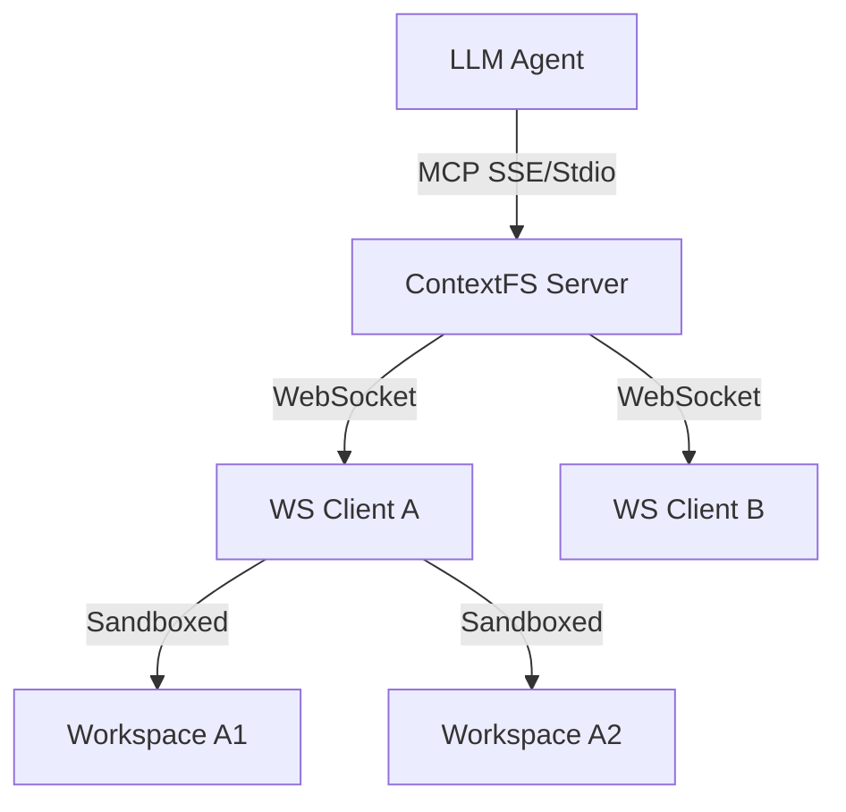

# contextfs

**Context filesystem server/client for LLM agents** — MCP-compatible, multi-tenant, zero-dependency dashboard.

> Author: Javier Leandro Arancibia — [intrane.fr](https://intrane.fr) · arancibiajav@gmail.com

---

## Architecture



ContextFS follows a **Hub-and-Spoke** architecture:
- **Server (Hub)**: Manages authentication, virtual client registration, and sticky scheduling.
- **WS Client (Spoke)**: Physically executes tool calls in a sandboxed environment.
- **Local Mode**: For single-machine use, the server acts as its own spoke.

---

## What is contextfs?

`contextfs` gives LLM agents a **persistent, structured filesystem** they can read from, write to, and search — without giving them direct access to your machine.

It exposes a standard **MCP (Model Context Protocol)** surface over SSE or stdio, so any MCP-compatible LLM client (Claude Desktop, Cursor, custom agents) can use it out of the box.

### Key concepts

| Concept | Description |
|---|---|
| **WS Client** | A machine/process that physically executes tool calls. Connects to the server via WebSocket. |
| **Virtual Client** | A logical tenant (agent, user, project). Has its own API key, workspace, skills, and memory. Multiple VCs can be served by the same WS client. |
| **Workspace** | A directory scoped to a virtual client. All file operations are sandboxed within it. |
| **Local mode** | Server executes tools in-process — no WS client needed. Ideal for single-machine use. |

---

## Quick start

### Option A — Local mode (simplest, single machine)

```bash
npx contextfs server --local --mcp sse
```

```bash
# Create a virtual client
curl -s -X POST http://localhost:3010/api/virtual-clients \
  -H 'Content-Type: application/json' \
  -d '{"name":"my-agent"}' | jq .
# → copy "id" and "apiKey"

# Open dashboard
open http://localhost:3010

# Chat
CONTEXTFS_VC_ID=<id> CONTEXTFS_VC_KEY=<key> OPENROUTER_API_KEY=sk-or-... \
  npx contextfs chat --mcp-server http://localhost:3010
```

### Option B — Remote WS client mode

```bash
# Terminal 1 — server
npx contextfs server --mcp sse

# Terminal 2 — create entities
curl -s -X POST http://localhost:3010/api/ws-clients \
  -H 'Content-Type: application/json' -d '{"name":"worker-1"}' | jq .
# → copy wsc id + apiKey

curl -s -X POST http://localhost:3010/api/virtual-clients \
  -H 'Content-Type: application/json' -d '{"name":"agent-1"}' | jq .
# → copy vc id + apiKey

# Terminal 3 — WS client (can be on a different machine)
CONTEXTFS_API_KEY=<wsc-key> \
  npx contextfs client \
    --url ws://localhost:3010 \
    --ws-client-id <wsc-id> \
    --api-key <wsc-key>

# Terminal 4 — chat
CONTEXTFS_VC_ID=<vc-id> CONTEXTFS_VC_KEY=<vc-key> OPENROUTER_API_KEY=sk-or-... \
  npx contextfs chat --mcp-server http://localhost:3010
```

---

## CLI reference

### `contextfs server`

```
contextfs server [options]

Options:
  --port <port>       HTTP + WS port (default: 3010, env: PORT)
  --local             Local mode: tools run in-process, no WS clients (env: CONTEXTFS_LOCAL=1)
  --mcp [sse]         Enable MCP server
                        (default: stdio — requires --vc-id + --vc-key)
                        (sse — VC creds per-connection: ?vcId=&vcKey= or headers)
  --vc-id <id>        Virtual client ID for stdio MCP (env: CONTEXTFS_VC_ID)
  --vc-key <key>      Virtual client API key for stdio MCP (env: CONTEXTFS_VC_KEY)
  --insecure          Enable contextfs.bash_script_once tool
  --verbose           Verbose logging
```

### `contextfs client`

```
contextfs client [options]

Options:
  --url <wsUrl>         Server WebSocket URL (required, env: CONTEXTFS_SERVER_URL)
  --ws-client-id <id>   WS client ID (required, env: CONTEXTFS_WS_CLIENT_ID)
  --api-key <key>       WS client API key (required, env: CONTEXTFS_API_KEY)
  --cwd <path>          Workspace root (default: ~/.contextfs/workspaces/<wsc-id>)
  --insecure            Enable contextfs.bash_script_once
  --verbose             Verbose logging
```

### `contextfs chat`

```
contextfs chat [options]

Options:
  --mcp-server <url>    MCP server base URL (default: http://localhost:3010)
  --vc-id <id>          Virtual client ID (env: CONTEXTFS_VC_ID)
  --vc-key <key>        Virtual client API key (env: CONTEXTFS_VC_KEY)
  --model <model>       LLM model via OpenRouter (env: CONTEXTFS_MODEL)
  --message <text>      Non-interactive: send single message, exit 0 (alias: -m)
  --stdin               Read message from stdin
  --output json         Output { message, toolCalls, durationMs } JSON
  --no-tools            Disable tool calls (pure LLM)
  --verbose             Verbose logging
```

**Interactive commands:** `/exit`, `/clear`, `/tools`, `/history`

---

## MCP integration

### SSE (recommended for web/agent use)

```
GET http://localhost:3010/mcp/sse?vcId=<id>&vcKey=<key>
POST http://localhost:3010/mcp/message?sessionId=<sessionId>
```

Or via headers:
```
GET http://localhost:3010/mcp/sse
X-VC-ID: <id>
Authorization: Bearer <key>
```

### stdio (for Claude Desktop, Cursor, etc.)

```json
{
  "mcpServers": {
    "contextfs": {
      "command": "npx",
      "args": ["contextfs", "server", "--local", "--mcp", "--vc-id", "<id>", "--vc-key", "<key>"]
    }
  }
}
```

---

## Tools reference

All tools are sandboxed within the virtual client's active workspace root.

| Tool | Description |
|---|---|
| `contextfs.list` | List files/directories. Supports recursive, depth, glob filter. **(RTK Optimized)** |
| `contextfs.read` | Read file content. Supports line ranges, byte limits, and **automatic filtering for large files (>500 lines)**. |
| `contextfs.summarize` | **(New)** Get an intelligent summary of a code file (signatures, docstrings, complexity) at 90% lower token cost. |
| `contextfs.write` | Write or append to a file. |
| `contextfs.list_workspaces` | List available workspaces for the current virtual client. |
| `contextfs.use_workspace` | Switch the active workspace for the current session. |
| `contextfs.save_skill` | Save a reusable skill as Markdown under `/skills/`. |
| `contextfs.list_skills` | List skills, optionally filtered by tag. |
| `contextfs.save_memory` | Persist a memory entry under `/memory/YYYY/MM/`. |
| `contextfs.search_memory` | Full-text keyword search across all memory files. |
| `contextfs.memory_summary` | Metadata summary of all memory entries. |
| `contextfs.memory_by_date` | Retrieve memories from a specific year/month. |
| `contextfs.memory_by_tag` | Find all memories with a specific tag. |
| `contextfs.bash_script_once` | Execute a one-shot bash script (requires `--insecure`). **(RTK Optimized for tests)** |

---

## RTK Integration (Token Optimization)

ContextFS integrates [RTK (Rust Token Killer)](https://github.com/rtk-ai/rtk) to significantly reduce token consumption (60-90%) when agents interact with the filesystem.

### How it works
When running in a Docker container or where the `rtk` binary is available:
- **Core Commands**: `ls`, `grep`, `git`, and `docker` are automatically proxied through RTK to strip redundant metadata and formatting.
- **Test Optimization**: `npm test`, `cargo test`, and `pytest` outputs are filtered to show only the first 5 failures and a summary, preventing token blowup on large suites.
- **Intelligent Summarization**: The `contextfs.summarize` tool leverages RTK's structural analysis to provide code overviews without reading full file content.
- **Ultra-Compact Mode**: Force maximum compression by setting `CONTEXTFS_RTK_ULTRA_COMPACT=true` or passing the `-u` flag to supported commands.

### Native Fallback
Integration is non-intrusive. If RTK is unavailable, fails, or a command is not supported, ContextFS automatically falls back to native execution to ensure reliability.

---

## REST API reference

Base URL: `http://localhost:3010/api`

### WS Clients

```
GET    /api/ws-clients                        List all WS clients
POST   /api/ws-clients                        Create WS client → returns apiKey (once)
DELETE /api/ws-clients/:id                    Delete WS client
POST   /api/ws-clients/:id/regen-key          Regenerate API key → returns new apiKey
```

### Virtual Clients

```
GET    /api/virtual-clients                   List all virtual clients
POST   /api/virtual-clients                   Create virtual client → returns apiKey (once)
DELETE /api/virtual-clients/:id               Delete virtual client + owned workspaces
POST   /api/virtual-clients/:id/regen-key     Regenerate API key
```

### Workspaces

```
GET    /api/virtual-clients/:vcId/workspaces              List workspaces
POST   /api/virtual-clients/:vcId/workspaces              Create workspace
DELETE /api/virtual-clients/:vcId/workspaces/:wsId        Delete workspace
```

### Dispatch

```
POST /api/dispatch
Body: { virtualClientId, virtualClientApiKey, tool, params, timeoutMs? }
```

Dispatches a tool call to the assigned WS client and waits for the response.

### Status + MCP

```
GET /api/status          Summary counts
GET /mcp/sessions        Active MCP SSE sessions
```

---

## Security model

- **WS client API keys** — authenticate each WS connection. Validated on every WebSocket message.
- **Virtual client API keys** — authenticate MCP sessions (`?vcKey=`) and REST dispatch calls. Each virtual client is fully isolated from others.
- **Path sandboxing** — all file operations are resolved within the workspace root. Any path traversal attempt (`../`) returns an error.
- **`bash_script_once`** — disabled by default. Requires explicit `--insecure` flag on both server and client.
- **API keys are shown only once** — on creation and on regen. Store them immediately.

---

## Documentation

- [MIGRATION.md](./docs/MIGRATION.md) — Upgrading from prototypes to v1.
- [RUNBOOK.md](./docs/RUNBOOK.md) — Operational guide, scaling, and maintenance.

---

## Dashboard

Open `http://localhost:3010` after starting the server. The dashboard shows:
- WS clients with live status, CPU load, RAM usage, heartbeat time
- Virtual clients with assignment status
- Workspaces per virtual client
- Active MCP sessions

No login required — serve behind a reverse proxy with authentication for production use.

---

## Data directory

All state is persisted to `~/.contextfs/`:

```
~/.contextfs/
├── ws-clients.json         WS client registry
├── virtual-clients.json    Virtual client registry
├── workspaces.json         Workspace registry
├── chat-config.json        Chat TUI config (API key, model)
├── .machine-id             Persistent client identity
└── workspaces/
    └── <vcId>/
        └── <wsId>/
            ├── skills/     Saved skills (.md files)
            ├── memory/     Memory entries (YYYY/MM/*.md)
            └── ...         Your files
```

---

## Environment variables

| Variable | Description | Default |
|---|---|---|
| `PORT` | Server HTTP port | `3010` |
| `CONTEXTFS_LOCAL` | Enable local mode (`1`) | — |
| `CONTEXTFS_INSECURE` | Enable bash_script_once (`1`) | — |
| `CONTEXTFS_SERVER_URL` | WS server URL for client | — |
| `CONTEXTFS_WS_CLIENT_ID` | WS client ID | — |
| `CONTEXTFS_API_KEY` | WS client API key | — |
| `CONTEXTFS_VC_ID` | Virtual client ID for chat/MCP | — |
| `CONTEXTFS_VC_KEY` | Virtual client API key for chat/MCP | — |
| `CONTEXTFS_MCP_SERVER` | MCP server base URL for chat | `http://localhost:3010` |
| `CONTEXTFS_MODEL` | LLM model for chat | `google/gemini-2.5-flash-preview` |
| `OPENROUTER_API_KEY` | OpenRouter API key for chat | — |
| `CONTEXTFS_RTK_ENABLED` | Enable RTK optimization (`true`/`false`) | `true` (auto-detect) |
| `CONTEXTFS_RTK_ULTRA_COMPACT` | Enable ultra-compact mode (`true`) | `false` |
| `VERBOSE` | Enable verbose logging (`1`) | — |

---

## Requirements

- Node.js ≥ 18
- No build step required
- No native modules

## License

MIT © [Javier Leandro Arancibia](https://intrane.fr)
